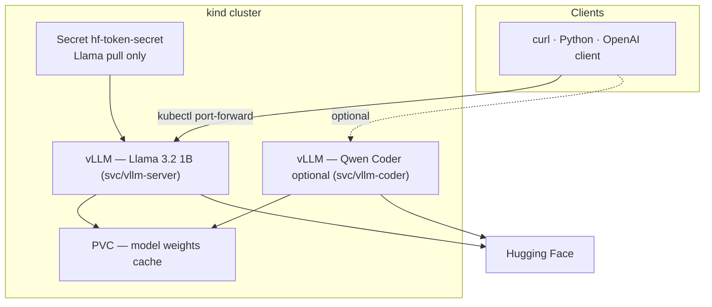
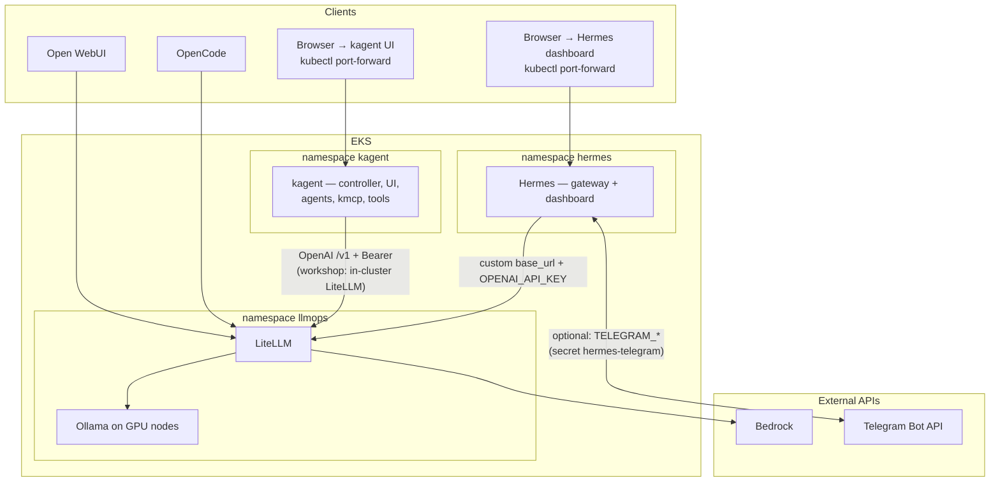

<style>
.slidev-layout {
  background: #f7f7f7 !important;
  color: #000000 !important;
  font-weight: 400 !important;
}

.slidev-page {
  background: #f7f7f7 !important;
}

h1, h2, h3, h4, h5, h6, p, div, span, a, li, td, th, label, button {
  color: #000000 !important;
  font-weight: 400 !important;
}

.slidev-layout a {
  color: #0066cc !important;
}

.slidev-layout a:hover {
  color: #0052a3 !important;
}

.slidev-page:has(.title-slide-hero) {
  overflow: visible !important;
}

/* Evita que el layout centre verticalmente todo el bloque (la imagen grande quedaba fuera de pantalla). */
.slidev-page:has(.title-slide-stack) .slidev-layout {
  justify-content: flex-start !important;
  align-items: center !important;
  padding-top: 1.5rem !important;
  box-sizing: border-box;
}

.title-slide-stack {
  display: flex;
  flex-direction: column;
  align-items: center;
  width: 100%;
  max-width: 100%;
}

.title-slide-stack h1 {
  margin-top: 0 !important;
  margin-bottom: 0.25em !important;
}

.title-slide-stack h2 {
  margin-top: 0 !important;
  margin-bottom: 0.35em !important;
}

.title-slide-stack > p {
  margin: 0 0 0.25rem !important;
}

.title-slide-hero {
  margin-top: -1.5rem;
  margin-bottom: -6.5rem;
}
@media (min-width: 768px) {
  .title-slide-hero {
    margin-top: -2.25rem;
    margin-bottom: -7.5rem;
  }
}
.title-slide-hero img {
  width: auto;
  max-width: min(100%, 72rem);
  height: auto;
  max-height: min(88vh, 720px);
  object-fit: contain;
  transform: translateY(-6rem);
}
@media (min-width: 768px) {
  .title-slide-hero img {
    max-height: min(92vh, 880px);
    transform: translateY(-8.5rem);
  }
}

.slidev-layout:has(.slide-diagram-center) {
  display: flex !important;
  flex-direction: column !important;
  justify-content: flex-start !important;
  min-height: calc(100vh - 3rem);
}

.slide-diagram-center {
  flex: 1;
  min-height: 0;
  max-height: calc(100vh - 6rem);
  display: flex;
  align-items: center;
  justify-content: center;
  width: 100%;
}

.slide-diagram-center img {
  width: auto;
  max-width: min(100%, 96vw);
  height: auto;
  max-height: 100%;
  object-fit: contain;
}

.slidev-page:has(.slide-diagram-center) {
  overflow: visible !important;
}
</style>

<div class="title-slide-stack">

# LLMOps Platform Workshop
## Governing AI in Difficult Times

Asturias Software Crafters

<div class="title-slide-hero flex justify-center w-full">
  
</div>

</div>

---

## About us

<div class="grid grid-cols-2 gap-8 items-center mt-6">
  <div>
    
  </div>
  <div class="text-left">
    <h3 class="!text-2xl !mb-3">Guille Vigil</h3>
    <p class="!mb-2">CEO &amp; Cofounder @ Resizes</p>
    <p class="!mb-2">CNCF Kubestronaut</p>
    <p class="!mb-2">
      GitHub:
      <a href="https://github.com/guillermotti" target="_blank">github.com/guillermotti</a>
    </p>
    <p class="!mb-5">
      LinkedIn:
      <a href="https://www.linkedin.com/in/guillermotti/" target="_blank">linkedin.com/in/guillermotti</a>
    </p>
    
  </div>
</div>

---

## About us

<div class="grid grid-cols-2 gap-8 items-center mt-6">
  <div>
    
  </div>
  <div class="text-left">
    <h3 class="!text-2xl !mb-3">Ramiro Álvarez</h3>
    <p class="!mb-2">CTO &amp; Cofounder @ Resizes</p>
    <p class="!mb-2">CNCF Golden Kubestronaut</p>
    <p class="!mb-2">
      GitHub:
      <a href="https://github.com/kaskol10" target="_blank">github.com/kaskol10</a>
    </p>
    <p class="!mb-5">
      LinkedIn:
      <a href="https://www.linkedin.com/in/ramiroalvfer/" target="_blank">linkedin.com/in/ramiroalvfer</a>
    </p>
    
  </div>
</div>

---
layout: section
---

<div class="title-slide-stack">

# Why this workshop?

<div class="title-slide-hero flex justify-center w-full">
  
</div>

</div>

---

## Problem

- Most teams rely on third-party LLM providers.
- Costs, policy changes, and availability can shift overnight.
- We need a path to technological sovereignty.

## Goal

- Part 1: Deploy and run self-hosted inference locally on Kubernetes using `kind` + `vLLM`.

- Part 2: Create a simple LLMOps Platform on top of EKS.

---
layout: section
---

<div class="title-slide-stack">

# Prerequisites

<div class="title-slide-hero flex justify-center w-full">
  
</div>

</div>

---

## Required tools — Part 1 (kind + vLLM)

**CLIs**:

- [Docker](https://docs.docker.com/get-docker/)
- [kubectl](https://kubernetes.io/docs/tasks/tools/)
- [kind](https://kind.sigs.k8s.io/docs/user/quick-start/#installation)
- [curl](https://curl.se/download.html)
- [jq](https://jqlang.github.io/jq/download/) 
- [git](https://git-scm.com/downloads)
- [Python](https://www.python.org/downloads/) + pip (optional — `pip install openai` examples)

**Machine:** 12 GB RAM minimum (16 GB recommended), 20 GB disk free.

**Accounts:** Hugging Face token (`read`) + license accepted for [`meta-llama/Llama-3.2-1B-Instruct`](https://huggingface.co/meta-llama/Llama-3.2-1B-Instruct).

---

## Required tools — Part 2 (EKS LLMOps Platform)

**CLIs**:

- [AWS CLI v2](https://docs.aws.amazon.com/cli/latest/userguide/getting-started-install.html)
- [eksctl](https://eksctl.io/installation/)
- [kubectl](https://kubernetes.io/docs/tasks/tools/)
- [Helm](https://helm.sh/docs/intro/install/)
- [curl](https://curl.se/download.html)
- [jq](https://jqlang.github.io/jq/download/)
- [git](https://git-scm.com/downloads)

**Machine:** 128 MB RAM minimum, 20 MB disk free.

**Accounts:** workshop IAM user keys for `aws` / `eksctl`, provided by Resizes!

---
layout: section
---

<div class="title-slide-stack">

# Hands-on: Main Deployment

<div class="title-slide-hero flex justify-center w-full">
  
</div>

</div>

---

## Clone the workshop repository

All manifests and docs live in the repo:

```bash
git clone https://github.com/resizes/asc-workshop.git
cd asc-workshop
```

Repository: [github.com/resizes/asc-workshop](https://github.com/resizes/asc-workshop)

---

## Local kind + vLLM architecture



---

## Step 1 - Create cluster

Running Kubernetes locally is easy:

```bash
kind create cluster --config kind/kind-config.yaml
```

Confirm cluster is up & running:

```bash
kubectl get nodes
```

Expected: 1 control-plane + 2 workers.

---

## Step 2 — Hugging Face account & model access

**Account:** If you do not have one yet, sign up at [huggingface.co/join](https://huggingface.co/join) and complete verification if Hugging Face asks for it.

**Model license:** The vLLM deployment pulls **Meta Llama 3.2 1B Instruct** from Hugging Face. Open the model card and accept the license / request access if prompted:

[meta-llama/Llama-3.2-1B-Instruct](https://huggingface.co/meta-llama/Llama-3.2-1B-Instruct)

Until access is granted, pulls will fail even with a valid token.

---

## Step 2 — Create your Hugging Face token

1. Open **[Settings → Access Tokens](https://huggingface.co/settings/tokens)** (avatar → **Settings** → **Access Tokens**).
2. Click **Create new token**.
3. **Name:** any label (e.g. `asc-workshop`).
4. **Type:** choose **Classic** (simplest for this lab) with permission **Read** — enough to download models your account can access.  
   If you use **Fine-grained** instead, grant **Read** on repository **`meta-llama/Llama-3.2-1B-Instruct`** (and any other gated repos you pull).
5. Click **Create**, then **copy the token** — it is shown only once. Keep it until you paste it into the command on the next slide (do not commit it to git).

---

## Step 2 — Kubernetes secret (`hf-token-secret`)

Resources go in the **default** namespace. Replace `YOUR_TOKEN_HERE` with the value you copied (no quotes in the literal):

```bash
kubectl create secret generic hf-token-secret \
  --from-literal=token=YOUR_TOKEN_HERE
```

Check if secret is created:

```bash
kubectl get secret hf-token-secret
```

---

## Step 3 - PVC for model cache

Models need persistance:

```bash
kubectl apply -f kind/pvc.yaml
kubectl get pvc
```

Purpose: persist downloaded model files between pod restarts.

---

## Step 4 - Deploy vLLM

Serving models in Kubernetes is as easy as running one command:

```bash
kubectl apply -f kind/deployment.yaml
```

Notes:
- first run downloads model (~2.5 GB)
- can take several minutes
- probes may need larger `initialDelaySeconds` on slower machines

Check pod status:

```bash
kubectl get pod
```

---

## Step 5 - Expose with service

The pod should be accessible:

```bash
kubectl apply -f kind/service.yaml
```

---

## Step 6 - Verify deployment

If pod is not running and ready, party doesn't start:

```bash
kubectl get pods -w
kubectl logs -l app.kubernetes.io/name=vllm -f
```

Ready signal:
- `READY 1/1`
- server listening on `:8000`

---

## Step 7 - Port-forward (Llama / general model)

Let's create a tunnel between Kubernetes network and your host:

```bash
kubectl port-forward svc/vllm-server 8000:8000
```

---

## Step 7b - List models

Use another terminal for the API calls:

```bash
curl http://localhost:8000/v1/models | jq .
```

---

## Step 7c - Completion (legacy API)

vLLM is 3 years old, but there is already a legacy API:

```bash
curl http://localhost:8000/v1/completions \
  -H "Content-Type: application/json" \
  -d '{
    "model": "meta-llama/Llama-3.2-1B-Instruct",
    "prompt": "Kubernetes is a container orchestration platform that",
    "max_tokens": 50,
    "temperature": 0.7
  }' | jq .
```

---

## Step 7d - Chat completion

The new API schema is more agentic ready:

```bash
curl http://localhost:8000/v1/chat/completions \
  -H "Content-Type: application/json" \
  -d '{
    "model": "meta-llama/Llama-3.2-1B-Instruct",
    "messages": [
      {"role": "system", "content": "You are an expert DevOps assistant."},
      {"role": "user", "content": "What is LLMOps and why is it important?"}
    ],
    "max_tokens": 200,
    "temperature": 0.7
  }' | jq .
```

---

## Step 7e - OpenAI client

Install and run:

```bash
python3 -m venv .venv && source .venv/bin/activate
pip install openai --index-url https://pypi.org/simple
cat <<'PY' > demo.py
from openai import OpenAI

client = OpenAI(
    base_url="http://localhost:8000/v1",
    api_key="not-required",
)

response = client.chat.completions.create(
    model="meta-llama/Llama-3.2-1B-Instruct",
    messages=[
        {"role": "system", "content": "You are an expert DevOps assistant."},
        {"role": "user", "content": "Explain what technological sovereignty in AI means."},
    ],
    max_tokens=300,
)

print(response.choices[0].message.content)
PY
python demo.py
```

---
layout: section
---

<div class="title-slide-stack">

# Prompting and LLMOps Patterns

<div class="title-slide-hero flex justify-center w-full">
  
</div>

</div>


---

## Context Window 


---

## Temperature

<div class="slide-diagram-center">
  
</div>

---

## Code generation

Low `temperature` (0.1–0.3) for code.

```bash
curl http://localhost:8000/v1/chat/completions \
  -H "Content-Type: application/json" \
  -d '{
    "model": "meta-llama/Llama-3.2-1B-Instruct",
    "messages": [
      {"role": "system", "content": "You are an expert Python developer. Respond only with clean, working code and a brief explanation."},
      {"role": "user", "content": "Write a Python function that retries a failed HTTP request up to 3 times with exponential backoff."}
    ],
    "max_tokens": 400,
    "temperature": 0.2
  }' | jq -r '.choices[0].message.content'
```

---

## Kubernetes manifest

Also great for building infra:

```bash
curl http://localhost:8000/v1/chat/completions \
  -H "Content-Type: application/json" \
  -d '{
    "model": "meta-llama/Llama-3.2-1B-Instruct",
    "messages": [
      {"role": "system", "content": "You are a Kubernetes expert. Output only valid YAML."},
      {"role": "user", "content": "Write a Kubernetes CronJob that runs a curl command to a health endpoint every 5 minutes and logs the response."}
    ],
    "max_tokens": 400,
    "temperature": 0.1
  }' | jq -r '.choices[0].message.content'
```

---

## Code review

Nice to add pull request reviews automatically:

```bash
curl http://localhost:8000/v1/chat/completions \
  -H "Content-Type: application/json" \
  -d '{
    "model": "meta-llama/Llama-3.2-1B-Instruct",
    "messages": [
      {"role": "system", "content": "You are a senior software engineer doing a code review. Be concise and focus on bugs and improvements."},
      {"role": "user", "content": "Review this Python code:\n\ndef get_user(id):\n    db = connect_db()\n    result = db.query(f'\''SELECT * FROM users WHERE id = {id}'\'')\n    return result"}
    ],
    "max_tokens": 300,
    "temperature": 0.3
  }' | jq -r '.choices[0].message.content'
```

---

## Reasoning — chain of thought

How agents are being created:

```bash
curl http://localhost:8000/v1/chat/completions \
  -H "Content-Type: application/json" \
  -d '{
    "model": "meta-llama/Llama-3.2-1B-Instruct",
    "messages": [
      {"role": "system", "content": "You are a debugging expert. Think through the problem step by step before giving your answer. Format your response as:\n\nThinking:\n<your reasoning>\n\nAnswer:\n<your conclusion>"},
      {"role": "user", "content": "A Kubernetes pod keeps restarting every 2 minutes. The logs show the process exits with code 137. What is causing this and how do I fix it?"}
    ],
    "max_tokens": 500,
    "temperature": 0.3
  }' | jq -r '.choices[0].message.content'
```

---

## Reasoning — multi-step

Very interesting for planning:

```bash
curl http://localhost:8000/v1/chat/completions \
  -H "Content-Type: application/json" \
  -d '{
    "model": "meta-llama/Llama-3.2-1B-Instruct",
    "messages": [
      {"role": "system", "content": "You are a senior DevOps architect. When given a problem, first list the steps to solve it, then implement each step."},
      {"role": "user", "content": "I need to set up a CI/CD pipeline that: builds a Docker image, runs tests, pushes to a registry, and deploys to Kubernetes. Give me the GitHub Actions workflow."}
    ],
    "max_tokens": 600,
    "temperature": 0.2
  }' | jq -r '.choices[0].message.content'
```

---

## Step 11: Remove the Llama / General Model Resources (Recommended Before Qwen)

On a typical local `kind` cluster, two vLLM pods compete heavily for CPU and memory. Before deploying Qwen, tear down the general-model workload so the coder model can load and serve reliably.

If any terminal still has `kubectl port-forward` pointing at `svc/vllm-server`, stop it first (`Ctrl+C`).

```bash
kubectl delete deployment vllm-server
kubectl delete service vllm-server
kubectl delete pvc vllm-models
```

Deleting the PVC frees disk and removes the cached Llama weights from that volume; if you deploy the Llama manifest again later, the model will be downloaded again.

If your machine has enough resources, you can **skip this step** and run Llama and Qwen at the same time (general API on port `8000`, coder on `8001`), then two port-forwards are needed.

---
layout: section
---

<div class="title-slide-stack">

# Specialized model for coding

<div class="title-slide-hero flex justify-center w-full">
  
</div>

</div>

---

## Step 12: Deploy a Dedicated Coding Model

The Llama 3.2 1B model is a great general-purpose model, but for coding tasks a specialized model does significantly better. We deploy **Qwen 2.5 Coder 1.5B Instruct** — no Hugging Face token required.

In production you often **route workloads to different models** (general vs code); here we either replace Llama with Qwen to save resources, or run both if you skipped Step 11.

Deploy the PVC, deployment and service:

```bash
kubectl apply -f kind/pvc-coder.yaml
kubectl apply -f kind/deployment-coder.yaml
kubectl apply -f kind/service-coder.yaml
```

---

## Verify the coder pod

Pod should be up & running:

```bash
kubectl get pods
```

If you removed Llama in Step 11, you should see only the coder pod (names will vary):

```
NAME                           READY   STATUS    RESTARTS   AGE
vllm-coder-xxx                 1/1     Running   0          2m
```

If you skipped Step 11 and still run Llama, you will see both `vllm-server` and `vllm-coder` pods.

---

## Port-forward the coder model

Expose Qwen on a local port (here `8001`). Stop any previous port-forward that still targets `vllm-server` unless you intentionally kept Llama running:

```bash
kubectl port-forward svc/vllm-coder 8001:8000
```

---

## Qwen — verify API

Run it against port `8001`:

```bash
curl http://localhost:8001/v1/models | jq .
```

---

## Qwen — Python + tests

Coding without burning money is possible:

```bash
curl http://localhost:8001/v1/chat/completions \
  -H "Content-Type: application/json" \
  -d '{
    "model": "Qwen/Qwen2.5-Coder-1.5B-Instruct",
    "messages": [
      {"role": "system", "content": "You are an expert Python developer. Write clean, well-tested code."},
      {"role": "user", "content": "Write a Python function that parses a Kubernetes resource string like '\''100m'\'' (millicores) or '\''2'\'' (cores) and returns the value in millicores as an integer. Include unit tests using pytest."}
    ],
    "max_tokens": 600,
    "temperature": 0.1
  }' | jq -r '.choices[0].message.content'
```

---

## Qwen — Helm values

Building platforms is possible as well:

```bash
curl http://localhost:8001/v1/chat/completions \
  -H "Content-Type: application/json" \
  -d '{
    "model": "Qwen/Qwen2.5-Coder-1.5B-Instruct",
    "messages": [
      {"role": "system", "content": "You are a Kubernetes and Helm expert. Output only valid YAML with comments."},
      {"role": "user", "content": "Write a Helm values.yaml for a web application deployment with: configurable replicas, resource requests/limits, ingress with TLS, horizontal pod autoscaler, and a PostgreSQL dependency."}
    ],
    "max_tokens": 700,
    "temperature": 0.1
  }' | jq -r '.choices[0].message.content'
```

---

## Qwen — debug code

Kill the bugs:

```bash
curl http://localhost:8001/v1/chat/completions \
  -H "Content-Type: application/json" \
  -d '{
    "model": "Qwen/Qwen2.5-Coder-1.5B-Instruct",
    "messages": [
      {"role": "system", "content": "You are a debugging expert. Identify all bugs, explain each one, and provide the fixed code."},
      {"role": "user", "content": "Find the bugs in this Python code:\n\nimport threading\n\nresults = []\n\ndef fetch(url):\n    import urllib.request\n    data = urllib.request.urlopen(url).read()\n    results.append(data)\n\nurls = ['\''http://example.com'\''] * 10\nthreads = [threading.Thread(target=fetch, args=(u,)) for u in urls]\nfor t in threads: t.start()\nprint(f'\''Fetched {len(results)} pages'\'')"}
    ],
    "max_tokens": 500,
    "temperature": 0.2
  }' | jq -r '.choices[0].message.content'
```

---

## Compare both models side by side (optional) — Part 1

Only works when **both** `vllm-server` and `vllm-coder` are running. Same coding prompt to Llama (`8000`) vs Qwen (`8001`):

```python
from openai import OpenAI

general = OpenAI(base_url="http://localhost:8000/v1", api_key="not-required")
coder = OpenAI(base_url="http://localhost:8001/v1", api_key="not-required")

prompt = (
    "Write a Python context manager that measures and prints "
    "the execution time of a code block."
)
```

---

## Compare both models side by side (optional) — Part 2

Same file / session as Part 1 (`prompt`, `general`, `coder`):

```python
def ask(client, model, label):
    response = client.chat.completions.create(
        model=model,
        messages=[
            {"role": "system", "content": "You are an expert Python developer. Be concise."},
            {"role": "user", "content": prompt},
        ],
        max_tokens=400,
        temperature=0.1,
    )
    print(f"\n{'='*60}")
    print(f"Model: {label}")
    print('='*60)
    print(response.choices[0].message.content)

ask(general, "meta-llama/Llama-3.2-1B-Instruct", "Llama 3.2 1B (general)")
ask(coder, "Qwen/Qwen2.5-Coder-1.5B-Instruct", "Qwen 2.5 Coder 1.5B (specialized)")
```

> **Takeaway**: The specialized coder model typically produces more idiomatic code, better error handling, and more complete solutions — even at a similar parameter count. Choosing the right model for the workload is a core LLMOps decision.

---

## Cleanup — Part 1 (local kind + vLLM)

Before Part 2, free **RAM**, **CPU**, and **disk** on your laptop and remove the local cluster so **`kubectl`** is not still pointed at **`kind`**.

1. Stop any **`kubectl port-forward`** to **`vllm-server`** or **`vllm-coder`** (`Ctrl+C` in those terminals).
2. From the **repository root** (same context you used for Part 1):

```bash
kubectl delete deployment vllm-server vllm-coder --ignore-not-found
kubectl delete service vllm-server vllm-coder --ignore-not-found
kubectl delete pvc vllm-models vllm-models-coder --ignore-not-found
kubectl delete secret hf-token-secret --ignore-not-found
kind delete cluster --name llmops
```

Cluster name **`llmops`** matches **`kind/kind-config.yaml`**.

Optional — reclaim Docker image / layer disk after the lab:

```bash
docker system prune -a
```

---
layout: section
---

<div class="title-slide-stack">

# Part 2 — LLMOps Platform

<div class="title-slide-hero flex justify-center w-full">
  
</div>

</div>

---

## What we add on AWS

- **EKS** cluster named with your **GitHub username**
- **GPU** managed node group (**g4dn.xlarge**) for **Ollama**
- **LiteLLM** as the single **OpenAI-compatible** gateway
- **Amazon Bedrock** (**Devstral-2-123B-Instruct-2512** via **`mistral.devstral-2-123b`**) via **IRSA**
- **Open WebUI**, **OpenCode** — all through LiteLLM
- **[kagent](https://kagent.dev/)** in namespace **`kagent`** — agents, **kmcp**, and UI on-cluster via **Helm**; this workshop points the default **OpenAI**-compatible provider at **LiteLLM** in **`llmops`** ([BYO OpenAI-compatible](https://kagent.dev/docs/kagent/supported-providers/byo-openai))
- **[Hermes Agent](https://hermes-agent.nousresearch.com/)** ([Nous Research](https://www.nousresearch.com/)) in namespace **`hermes`** — gateway, dashboard, and OpenAI-compatible API ([Docker runbook](https://hermes-agent.nousresearch.com/docs/user-guide/docker)); main chat goes to **LiteLLM** with alias **`devstral-2-123b-instruct-bedrock`** (Bedrock in **`llmops`**, same pattern as [OpenAI-compatible `base_url`](https://hermes-agent.nousresearch.com/docs/user-guide/docker#connecting-to-local-inference-servers-vllm-ollama-etc)); optional **[Telegram](https://hermes-agent.nousresearch.com/docs/user-guide/messaging/telegram)** bot via secret **`hermes-telegram`**

---

## Credentials (summary)

| What | Secret / auth |
|------|---------------|
| **`aws` / `eksctl` / cluster** | Lab **IAM user keys** |
| **LiteLLM → Bedrock** | **IRSA** · SA **`litellm`** · **`llmops`** |
| **kagent → LiteLLM** | **`kagent-openai`/`OPENAI_API_KEY`** = master key (same as OWUI / OpenCode) |
| **Hermes → LiteLLM** | **`hermes-litellm`** → **`OPENAI_API_KEY`** · **`model`** **`devstral-2-123b-instruct-bedrock`** (`09` / `05`) |
| **Hermes `/v1` API** | **`hermes-gateway`/`API_SERVER_KEY`** ([doc](https://hermes-agent.nousresearch.com/docs/user-guide/features/api-server)) |
| **Hermes Telegram** (opt.) | **`hermes-telegram`** · **`TELEGRAM_*`** ([doc](https://hermes-agent.nousresearch.com/docs/user-guide/messaging/telegram)) |

---

## LLMOps Logical Diagram

<div class="slide-diagram-center">
  
</div>

---

## EKS LLMOps architecture



---

## Step-by-step (overview)

1. AWS CLI + **`WORKSHOP_AWS_ACCOUNT_ID`** (from STS) + **`CLUSTER_NAME`** / **`eu-west-1`**
2. **`eksctl create cluster -f eks/eksctl-cluster.yaml`** (GPU node + OIDC)
3. **IRSA** — IAM role + **`01-litellm-serviceaccount.yaml`**
4. Namespace **`llmops`** + secret **`litellm-secrets`** (`LITELLM_MASTER_KEY` only)
5. **`sed`** ServiceAccount placeholder + **`kubectl apply -k eks/manifests/`** — LiteLLM + Ollama
6. **`ollama pull`** `llama3.2:1b` + `qwen2.5-coder:1.5b`
7. Verify LiteLLM (**port-forward**, curl Ollama alias + **Bedrock** alias)
8. **Helm** Open WebUI → **`eks/helm/open-webui-values.yaml`**
9. **OpenCode** on your laptop → LiteLLM via port-forward
10. **Helm** [kagent](https://kagent.dev/docs/kagent/introduction/installation#using-helm) — namespace **`kagent`**: **`kagent-crds`** then **`kagent`** chart
11. **Hermes** — namespace **`hermes`**: **`hermes-litellm`** + **`hermes-gateway`** secrets, **`09–11`** manifests (LiteLLM **`/v1`** + **`devstral-2-123b-instruct-bedrock`**); optional **Telegram** via **`hermes-telegram`**

---

## Step 1 — Configure AWS credentials and environment

Set AWS access keys and region. Use your GitHub username as cluster name:

```bash
export AWS_ACCESS_KEY_ID="..."
export AWS_SECRET_ACCESS_KEY="..."
export AWS_REGION="eu-west-1"
export CLUSTER_NAME="your-github-handle"   # EKS cluster name
```

Check credentials and capture the **AWS account ID** used for IAM and ARNs:

```bash
export WORKSHOP_AWS_ACCOUNT_ID="$(aws sts get-caller-identity --query Account --output text)"
echo "WORKSHOP_AWS_ACCOUNT_ID=$WORKSHOP_AWS_ACCOUNT_ID"
aws sts get-caller-identity
```

---

## Step 2 — Create the EKS cluster (GPU + OIDC)

From the **repository root**, patch the cluster name and create the cluster:

```bash
sed -i '' "s/REPLACE_GITHUB_USERNAME/${CLUSTER_NAME}/g" eks/eksctl-cluster.yaml   # macOS
# sed -i "s/REPLACE_GITHUB_USERNAME/${CLUSTER_NAME}/g" eks/eksctl-cluster.yaml     # Linux

eksctl create cluster -f eks/eksctl-cluster.yaml
```

Verify nodes and GPU allocatable (**`g4dn.xlarge`**, label **`workload: gpu`**). If **`nvidia.com/gpu`** is missing, install the [NVIDIA device plugin for EKS](https://docs.aws.amazon.com/eks/latest/userguide/device-plugins.html) and re-check.

```bash
kubectl get nodes -o wide
kubectl get nodes -o json | jq '.items[].status.allocatable | "nvidia: " + (.["nvidia.com/gpu"] // "none")'
```

Cluster template enables **EBS CSI**; manifests set default **`gp3`** **`StorageClass`** for **`ollama-data`**.

---

## Step 3 — IRSA: OIDC issuer

Policy **`WorkshopBedrockInvoke`**: **`arn:aws:iam::${WORKSHOP_AWS_ACCOUNT_ID}:policy/WorkshopBedrockInvoke`** (must exist in the same account as **`WORKSHOP_AWS_ACCOUNT_ID`** from Step 1).

Resolve OIDC (**after cluster exists**). Re-export **`WORKSHOP_AWS_ACCOUNT_ID`** if you opened a new shell:

```bash
export WORKSHOP_AWS_ACCOUNT_ID="${WORKSHOP_AWS_ACCOUNT_ID:-$(aws sts get-caller-identity --query Account --output text)}"
export OIDC_ISSUER="$(aws eks describe-cluster --name "$CLUSTER_NAME" --region "$AWS_REGION" \
  --query "cluster.identity.oidc.issuer" --output text)"
export OIDC_ID="$(basename "$OIDC_ISSUER")"
```

---

## Step 3 — IRSA: Trust policy

Write **`/tmp/litellm-trust-policy.json`** — Federated OIDC + **`system:serviceaccount:llmops:litellm`**:

```bash
cat > /tmp/litellm-trust-policy.json <<EOF
{
  "Version": "2012-10-17",
  "Statement": [{
    "Effect": "Allow",
    "Principal": {
      "Federated": "arn:aws:iam::${WORKSHOP_AWS_ACCOUNT_ID}:oidc-provider/oidc.eks.${AWS_REGION}.amazonaws.com/id/${OIDC_ID}"
    },
    "Action": "sts:AssumeRoleWithWebIdentity",
    "Condition": {
      "StringEquals": {
        "oidc.eks.${AWS_REGION}.amazonaws.com/id/${OIDC_ID}:aud": "sts.amazonaws.com",
        "oidc.eks.${AWS_REGION}.amazonaws.com/id/${OIDC_ID}:sub": "system:serviceaccount:llmops:litellm"
      }
    }
  }]
}
EOF
```

---

## Step 3 — IRSA: IAM role and ServiceAccount

Create role + attach policy:

```bash
aws iam create-role \
  --role-name litellm-bedrock-eu-west-1 \
  --assume-role-policy-document file:///tmp/litellm-trust-policy.json \
  --description "IRSA for LiteLLM (llmops/litellm)"

aws iam attach-role-policy \
  --role-name litellm-bedrock-eu-west-1 \
  --policy-arn arn:aws:iam::${WORKSHOP_AWS_ACCOUNT_ID}:policy/WorkshopBedrockInvoke
```

If **`create-role`** fails with **EntityAlreadyExists**:

```bash
aws iam update-assume-role-policy \
  --role-name litellm-bedrock-eu-west-1 \
  --policy-document file:///tmp/litellm-trust-policy.json
```

---

## Step 4 — Namespace and LiteLLM master key

Proxy token only (Open WebUI / OpenCode / `curl`). **Do not** put AWS keys in this secret.

```bash
kubectl create namespace llmops --dry-run=client -o yaml | kubectl apply -f -

kubectl create secret generic litellm-secrets \
  -n llmops \
  --from-literal=LITELLM_MASTER_KEY="$(openssl rand -hex 24)"
```

Optional **Ollama Cloud** (uncomment the block in **`05-litellm-configmap.yaml`** if you use it):

```bash
kubectl create secret generic ollama-cloud \
  -n llmops \
  --from-literal=OLLAMA_API_KEY="YOUR_OLLAMA_CLOUD_KEY"
```

---

## Step 5 — Deploy Ollama and LiteLLM

Substitute **`REPLACE_AWS_ACCOUNT_ID`** in the ServiceAccount with **`WORKSHOP_AWS_ACCOUNT_ID`** (Step 1), then apply:

```bash
export WORKSHOP_AWS_ACCOUNT_ID="${WORKSHOP_AWS_ACCOUNT_ID:-$(aws sts get-caller-identity --query Account --output text)}"
sed -i '' "s/REPLACE_AWS_ACCOUNT_ID/${WORKSHOP_AWS_ACCOUNT_ID}/g" eks/manifests/01-litellm-serviceaccount.yaml   # macOS
# sed -i "s/REPLACE_AWS_ACCOUNT_ID/${WORKSHOP_AWS_ACCOUNT_ID}/g" eks/manifests/01-litellm-serviceaccount.yaml     # Linux

kubectl apply -k eks/manifests/
```

```bash
kubectl -n llmops rollout status deploy/ollama --timeout=600s
kubectl -n llmops rollout status deploy/litellm --timeout=300s
```

After ConfigMap edits:

```bash
kubectl -n llmops rollout restart deploy/litellm
```

---

## Step 6 — Pull Ollama models

Let's use same models than before:

```bash
kubectl -n llmops exec deploy/ollama -- ollama pull llama3.2:1b
kubectl -n llmops exec deploy/ollama -- ollama pull qwen2.5-coder:1.5b
```

Check models:

```bash
kubectl -n llmops exec deploy/ollama -- ollama list
```

---

## Step 7 — Verify LiteLLM (Ollama + Bedrock)

Terminal 1 — port-forward:

```bash
kubectl -n llmops port-forward svc/litellm 4000:4000
```

Terminal 2 — load key and test **Ollama** via LiteLLM, then **Bedrock** (IRSA):

```bash
export LITELLM_MASTER_KEY="$(kubectl -n llmops get secret litellm-secrets -o jsonpath='{.data.LITELLM_MASTER_KEY}' | base64 -d)"
```

```bash
curl -s http://127.0.0.1:4000/v1/chat/completions \
  -H "Authorization: Bearer $LITELLM_MASTER_KEY" \
  -H "Content-Type: application/json" \
  -d '{"model":"qwen-coder-local","messages":[{"role":"user","content":"Say hello."}]}' | jq .
```

```bash
curl -s http://127.0.0.1:4000/v1/chat/completions \
  -H "Authorization: Bearer $LITELLM_MASTER_KEY" \
  -H "Content-Type: application/json" \
  -d '{"model":"devstral-2-123b-instruct-bedrock","messages":[{"role":"user","content":"Ping"}]}' | jq .
```

---

## Step 8 — Open WebUI (Helm)

The open source chat client:

```bash
helm repo add open-webui https://helm.openwebui.com/
helm repo update

helm upgrade --install open-webui open-webui/open-webui \
  -n llmops \
  -f eks/helm/open-webui-values.yaml
```

Let's use it:

```bash
kubectl -n llmops port-forward svc/open-webui 8080:80
```

---

## Step 9 — OpenCode with LiteLLM (1/3)

Prerequisites: LiteLLM running (**Step 7** port-forward). Full walkthrough: [OpenCode Quickstart (LiteLLM)](https://docs.litellm.ai/docs/tutorials/opencode_integration).

```bash
kubectl -n llmops port-forward svc/litellm 4000:4000
```

If you don't have OpenCode installed:

```bash
curl -fsSL https://opencode.ai/install | bash
# or: npm install -g opencode-ai   OR   brew install sst/tap/opencode
opencode --version
```

```bash
mkdir -p ~/.config/opencode
```

---

## Step 9 — OpenCode with LiteLLM (2/3)

Create **`~/.config/opencode/opencode.json`** (global). **`baseURL`** must match the port-forward (**`http://127.0.0.1:4000/v1`**). Keys under **`models`** must match **`model_name`** in **`eks/manifests/05-litellm-configmap.yaml`** (workshop aliases):

```json
{
  "$schema": "https://opencode.ai/config.json",
  "provider": {
    "litellm": {
      "npm": "@ai-sdk/openai-compatible",
      "name": "LiteLLM",
      "options": { "baseURL": "http://127.0.0.1:4000/v1" },
      "models": {
        "llama-3-2-1b-local": { "name": "Llama 3.2 1B (Ollama)" },
        "qwen-coder-local": { "name": "Qwen 2.5 Coder (Ollama)" },
        "devstral-2-123b-instruct-bedrock": { "name": "Devstral 2 123B (Bedrock)" }
      }
    }
  }
}
```

---

## Step 9 — OpenCode with LiteLLM (3/3)

Let's run it:

```bash
export LITELLM_MASTER_KEY="$(kubectl -n llmops get secret litellm-secrets -o jsonpath='{.data.LITELLM_MASTER_KEY}' | base64 -d)"
echo $LITELLM_MASTER_KEY # Copy the result
opencode
```

In OpenCode: **`/connect`** → provider **`LiteLLM`** (must match **`"name"`** in **`opencode.json`**) → API key = **`LITELLM_MASTER_KEY`**. Then **`/models`** and pick an alias.

---

## Step 10 — kagent

[kagent](https://kagent.dev/) runs the controller, UI, bundled agents, **kmcp**, and (by default) a bundled PostgreSQL for evaluation. Install it **in its own namespace** so it stays isolated from **`llmops`**.

**Prerequisite:** LiteLLM is already running in **`llmops`** (Steps 5–7). This lab treats LiteLLM as an **OpenAI-compatible** upstream: set **`providers.openAI.config.baseUrl`** to the in-cluster LiteLLM **`/v1`** endpoint and use **`LITELLM_MASTER_KEY`** as the bearer token (same pattern as [BYO OpenAI-compatible](https://kagent.dev/docs/kagent/supported-providers/byo-openai)).

General Helm install: [Installing kagent — Using Helm](https://kagent.dev/docs/kagent/introduction/installation#using-helm).

---

## Step 10 — kagent: CRDs release

Install the **CRDs chart** once per cluster (release name **`kagent-crds`**). Skip this if you already installed it.

```bash
helm install kagent-crds oci://ghcr.io/kagent-dev/kagent/helm/kagent-crds \
  --namespace kagent \
  --create-namespace
```

---

## Step 10 — kagent: LiteLLM secret in `kagent`

The chart defaults to **`providers.openAI.apiKeySecretRef: kagent-openai`** and **`apiKeySecretKey: OPENAI_API_KEY`**. Reuse the workshop **`LITELLM_MASTER_KEY`** (from **`litellm-secrets`** in **`llmops`**) as that API key so kagent authenticates to LiteLLM like Open WebUI / OpenCode.

```bash
export LITELLM_MASTER_KEY="$(kubectl -n llmops get secret litellm-secrets -o jsonpath='{.data.LITELLM_MASTER_KEY}' | base64 -d)"

kubectl create secret generic kagent-openai -n kagent \
  --from-literal=OPENAI_API_KEY="$LITELLM_MASTER_KEY" \
  --dry-run=client -o yaml | kubectl apply -f -
```

To use another secret name or key, set **`providers.openAI.apiKeySecretRef`** / **`providers.openAI.apiKeySecretKey`** ([Helm values](https://kagent.dev/docs/kagent/resources/helm)).

---

## Step 10 — kagent: main chart (point at LiteLLM)

Install or upgrade the **kagent** chart. **`providers.openAI.model`** must be a **`model_name`** from **`eks/manifests/05-litellm-configmap.yaml`** (e.g. **`qwen-coder-local`**, **`llama-3-2-1b-local`**, **`devstral-2-123b-instruct-bedrock`**). **`baseUrl`** must include the **`/v1`** suffix LiteLLM exposes.

```bash
helm upgrade --install kagent oci://ghcr.io/kagent-dev/kagent/helm/kagent \
  --namespace kagent \
  -f eks/helm/kagent-values.yaml
```

Wait until workloads are ready:

```bash
kubectl -n kagent get pods
kubectl -n kagent wait --for=condition=Available deployment --all --timeout=600s
```

---

## Step 10 — kagent: open the UI

The chart exposes **`svc/kagent-ui`** on port **8080**. If your laptop already uses **8080** for Open WebUI, forward a different local port:

```bash
kubectl port-forward -n kagent svc/kagent-ui 8082:8080
```

Then open **`http://localhost:8082`** in the browser.

---
layout: section
---

<div class="title-slide-stack">

# Hermes Agent

<div class="title-slide-hero flex justify-center w-full">
  
</div>

</div>

---

## Hermes — what it is

[Hermes Agent](https://hermes-agent.nousresearch.com/) is an agent runtime with tools, memory, and an optional **OpenAI-compatible HTTP API** on port **8642** when **`API_SERVER_ENABLED=true`**.

Point the LLM at **LiteLLM** ([`base_url`](https://hermes-agent.nousresearch.com/docs/user-guide/docker#connecting-to-local-inference-servers-vllm-ollama-etc)) with **`OPENAI_API_KEY`** = **`LITELLM_MASTER_KEY`**. **`09-hermes-configmap.yaml`** sets **`model`** to **`devstral-2-123b-instruct-bedrock`** — the LiteLLM **`model_name`** alias that routes to **Bedrock** (defined in **`05-litellm-configmap.yaml`**). Change **`model`** in **`09`** to another alias from **`05`** (e.g. **`qwen-coder-local`**) if you prefer.

---

## Step 11 — Hermes: secrets and apply

Let's deploy it:

```bash
kubectl apply -f eks/manifests/08-hermes-namespace.yaml

export LITELLM_MASTER_KEY="$(kubectl -n llmops get secret litellm-secrets -o jsonpath='{.data.LITELLM_MASTER_KEY}' | base64 -d)"

kubectl create secret generic hermes-litellm -n hermes \
  --from-literal=LITELLM_MASTER_KEY="$LITELLM_MASTER_KEY" \
  --dry-run=client -o yaml | kubectl apply -f -

kubectl create secret generic hermes-gateway -n hermes \
  --from-literal=API_SERVER_KEY="$(openssl rand -hex 24)" \
  --dry-run=client -o yaml | kubectl apply -f -

kubectl apply -f eks/manifests/09-hermes-configmap.yaml \
  -f eks/manifests/10-hermes-deployment.yaml \
  -f eks/manifests/11-hermes-service.yaml
```

---

## Step 11 — Hermes: wait and port-forward

```bash
kubectl -n hermes rollout status deploy/hermes --timeout=600s

kubectl -n hermes port-forward svc/hermes 8643:8642 9120:9119
```

Dashboard: **`http://localhost:9120`**. Optional **`curl`** against the gateway (Bearer = **`API_SERVER_KEY`** from **`hermes-gateway`**):

```bash
export HERMES_API_KEY="$(kubectl -n hermes get secret hermes-gateway -o jsonpath='{.data.API_SERVER_KEY}' | base64 -d)"
curl -sS http://127.0.0.1:8643/v1/models -H "Authorization: Bearer $HERMES_API_KEY" | jq .
```

---

## Hermes — Telegram (optional)

Full guide: **[Telegram | Hermes Agent](https://hermes-agent.nousresearch.com/docs/user-guide/messaging/telegram)** (groups, webhooks, voice, **`/topic`**, allowlists, troubleshooting). On EKS, Hermes reaches Telegram with **long polling** (outbound); no public URL required unless you switch to **webhook** mode.

---

## Hermes — Telegram: BotFather and user ID

1. Open **[@BotFather](https://t.me/BotFather)** → **`/newbot`** → pick a **display name** and a **`…_bot`** **username** → copy the **API token**. If it leaks: **`/revoke`** in BotFather, then update the Kubernetes secret.
2. Your **numeric Telegram user ID** (not `@username`): message **[@userinfobot](https://t.me/userinfobot)** or **[@get_id_bot](https://t.me/get_id_bot)**. Hermes uses **`TELEGRAM_ALLOWED_USERS`** so only listed users can use the bot ([security](https://hermes-agent.nousresearch.com/docs/user-guide/messaging/telegram#security)).

---

## Hermes — Telegram: secret and rollout

The **`hermes`** Deployment injects **`TELEGRAM_BOT_TOKEN`** and **`TELEGRAM_ALLOWED_USERS`** from secret **`hermes-telegram`** via **`secretKeyRef`** (**`optional: true`** — Hermes still starts if you skip Telegram). Keys must match exactly (comma-separated user IDs in **`TELEGRAM_ALLOWED_USERS`**).

```bash
kubectl create secret generic hermes-telegram -n hermes \
  --from-literal=TELEGRAM_BOT_TOKEN='REPLACE_WITH_BOTFATHER_TOKEN' \
  --from-literal=TELEGRAM_ALLOWED_USERS='REPLACE_WITH_YOUR_NUMERIC_ID' \
  --dry-run=client -o yaml | kubectl apply -f -

kubectl -n hermes rollout restart deploy/hermes
kubectl -n hermes rollout status deploy/hermes --timeout=600s
```

---

## Hermes — Telegram: verify, webhooks, groups

**Verify:** DM your bot in Telegram; replies should appear within seconds on a normal EKS node pool.

**Webhooks:** for **serverless / sleep-on-idle** platforms, use **`TELEGRAM_WEBHOOK_URL`** + **`TELEGRAM_WEBHOOK_SECRET`** instead of polling — [webhook mode](https://hermes-agent.nousresearch.com/docs/user-guide/messaging/telegram#webhook-mode).

**Groups:** if DM works but **not** groups → [Privacy mode](https://hermes-agent.nousresearch.com/docs/user-guide/messaging/telegram#step-3-privacy-mode-critical-for-groups): BotFather **Bot Settings → Group Privacy → Turn off**, then **remove and re-add** the bot; or make the bot **group admin**. See [works in DMs but not groups](https://hermes-agent.nousresearch.com/docs/user-guide/messaging/telegram#troubleshooting-works-in-dms-but-not-groups) and **`TELEGRAM_GROUP_ALLOWED_CHATS`** / **`TELEGRAM_GROUP_ALLOWED_USERS`**.

**Optional:** BotFather **`/setdescription`**, **`/setabouttext`**, **`/setcommands`** — [Customize your bot](https://hermes-agent.nousresearch.com/docs/user-guide/messaging/telegram#step-2-customize-your-bot-optional).

---
layout: section
---

<div class="title-slide-stack">

# Cleanup

<div class="title-slide-hero flex justify-center w-full">
  
</div>

</div>

---

## Local workshop (kind + vLLM)

Same commands as **Cleanup — Part 1** (before Part 2). Stop **`kubectl port-forward`** first.

```bash
kubectl delete deployment vllm-server vllm-coder --ignore-not-found
kubectl delete service vllm-server vllm-coder --ignore-not-found
kubectl delete pvc vllm-models vllm-models-coder --ignore-not-found
kubectl delete secret hf-token-secret --ignore-not-found
kind delete cluster --name llmops
```

Optional disk cleanup:

```bash
docker system prune -a
```

---

## EKS lab (Part B)

From the **repository root**, with the same credentials and **`CLUSTER_NAME`** as **Step 1**:

```bash
export AWS_ACCESS_KEY_ID="..."
export AWS_SECRET_ACCESS_KEY="..."
export AWS_REGION="eu-west-1"
export CLUSTER_NAME="your-github-handle"

aws sts get-caller-identity

helm uninstall open-webui -n llmops 2>/dev/null || true
helm uninstall kagent -n kagent 2>/dev/null || true
helm uninstall kagent-crds -n kagent 2>/dev/null || true
kubectl delete namespace kagent --wait=true 2>/dev/null || true
kubectl delete namespace hermes --wait=true 2>/dev/null || true
kubectl delete namespace llmops --wait=true 2>/dev/null || true

eksctl delete cluster --name "$CLUSTER_NAME" --region "$AWS_REGION" --wait
```

```bash
aws eks list-clusters --region "$AWS_REGION" --query 'clusters' --output text
```

The IAM role from **Step 3** can stay; after a new cluster exists, run **Step 3** again so the trust policy matches the new OIDC issuer.

---
layout: center
class: text-center
---

# Thank you

Questions?
